# **GreenEdu Application**

**GreenEdu** is an educational app designed to teach children about the environment and the importance of environmental protection. With engaging lessons and fun activities, GreenEdu helps children understand the world around them and how they can contribute to saving the planet.

## [DEMO - DRIVE](https://drive.google.com/drive/folders/1qpDfUZo7zYmX5c1aA-rCBIbXzqBJ8KDb?usp=drive_link)

## Key Features

- **Topic-Based Learning**: Lectures are divided into various topics such as land environment, water environment, and more, making it easy for children to explore different aspects of environmental science.

- **Curated Content**: All lectures are carefully selected and developed before being posted on the app, ensuring that children receive accurate and quality educational materials.

- **Interactive Quizzes**: After each lesson, children can take multiple choice exercises to assess their understanding of the topic.

- **Environmental Activities and Stories**: The app includes a collection of social activities related to environmental protection and inspiring stories that promote empathy and environmental awareness among children.

    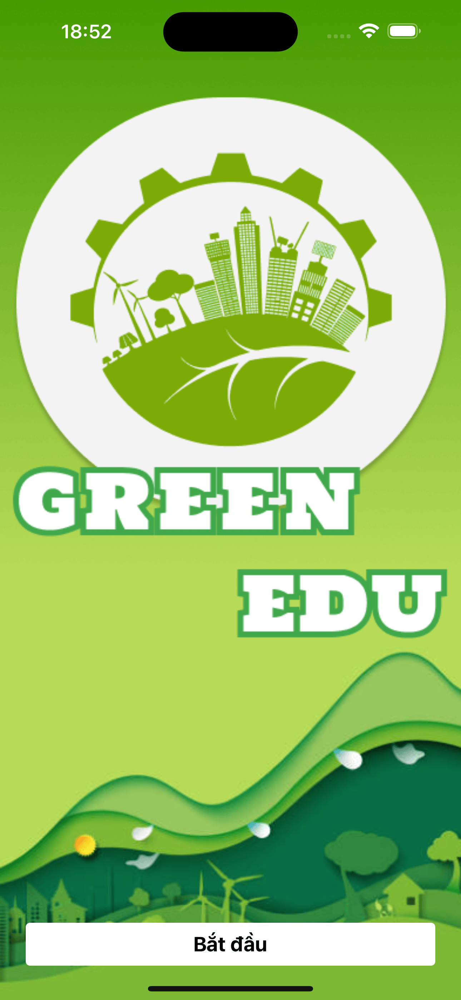
    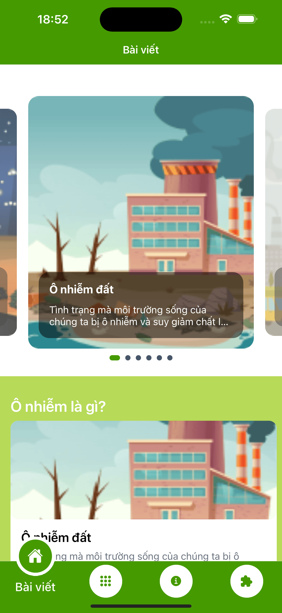
    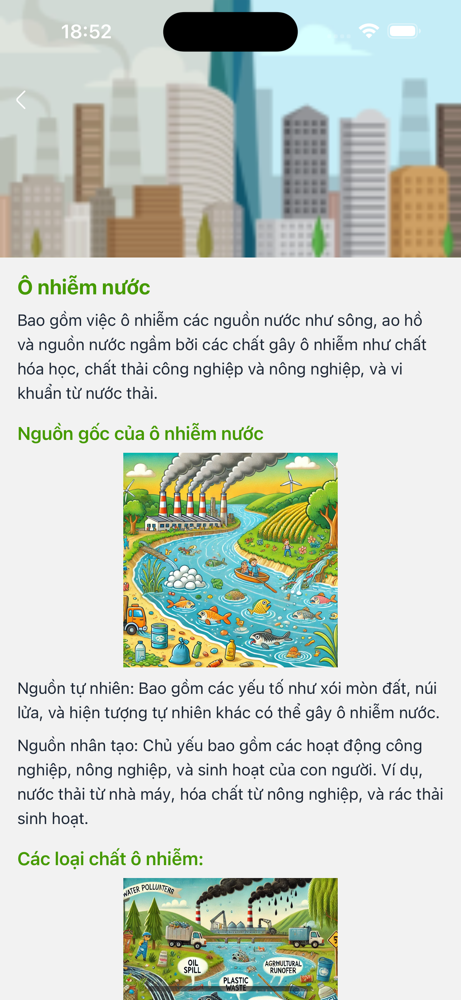
    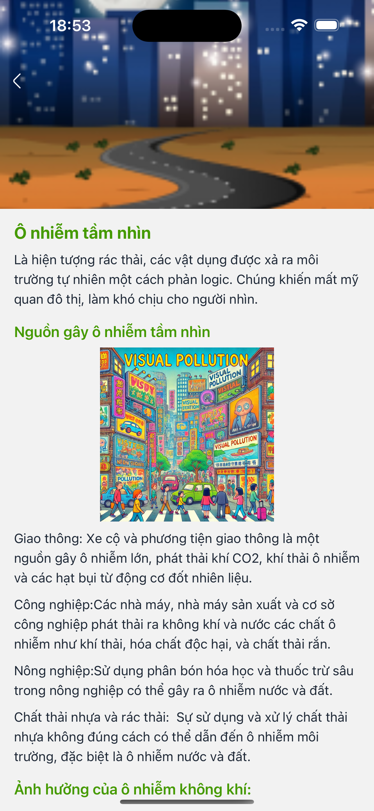
    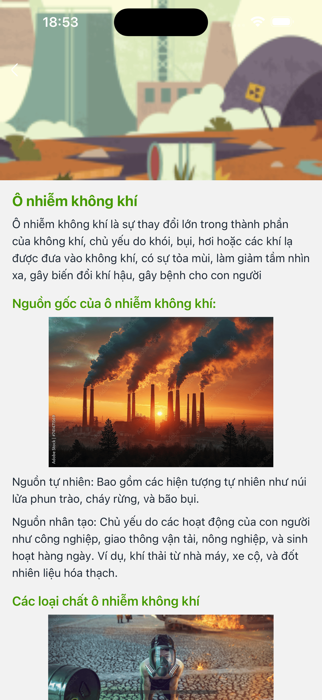
    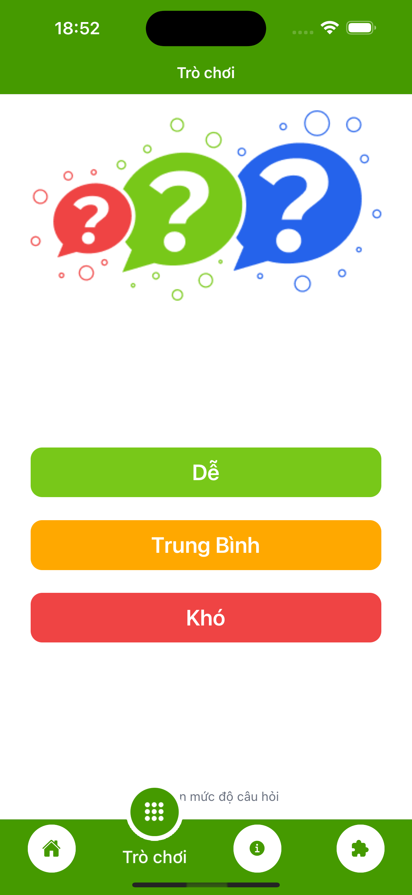
    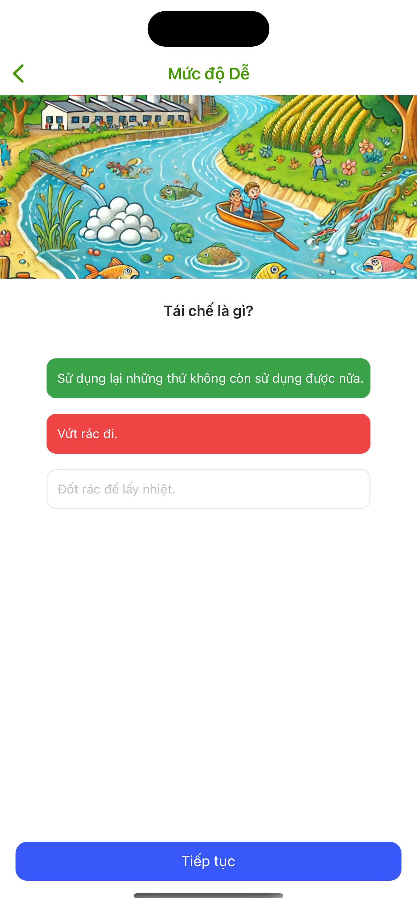
    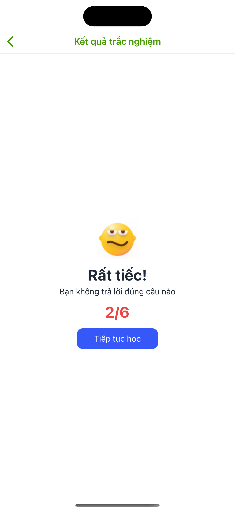
    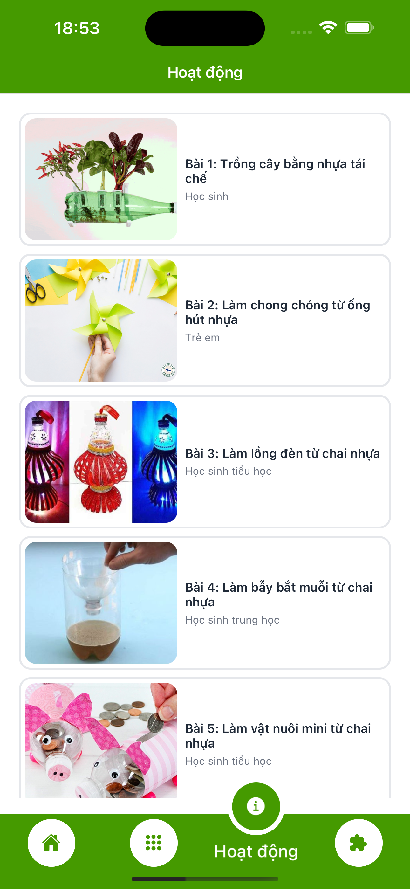
    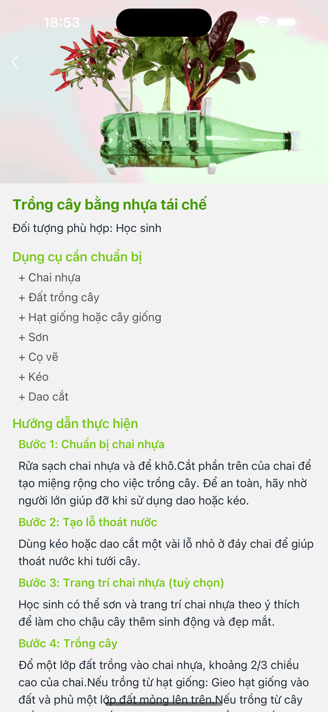
    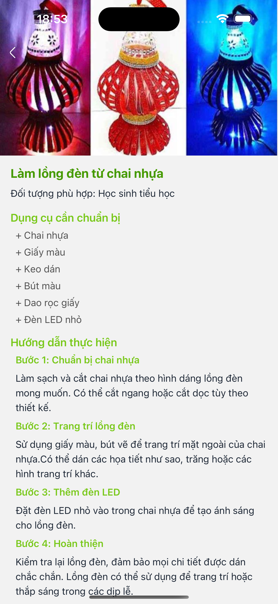
    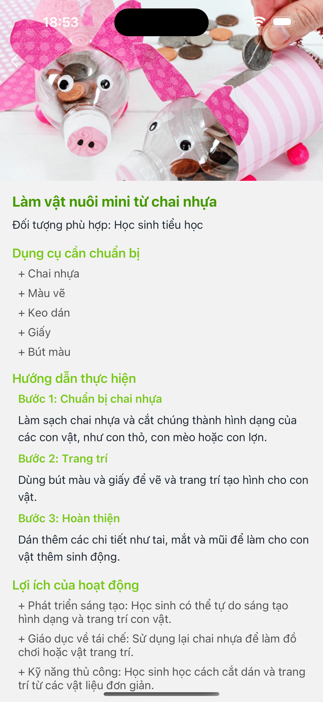
    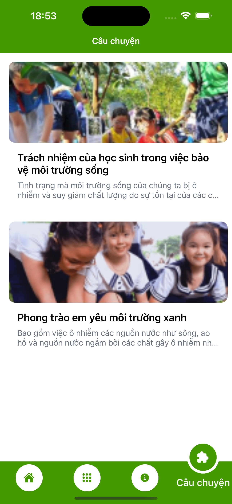
    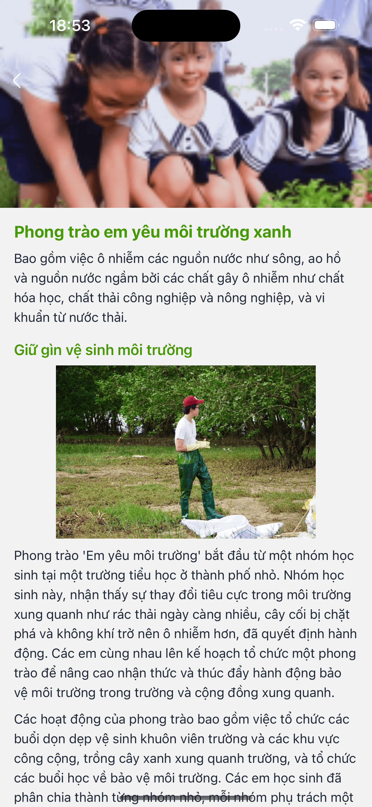

## Technology Stack

- **React Native**: Enables cross-platform development, ensuring GreenEdu works seamlessly on both iOS and Android devices.

- **Redux Toolkits**: Manages the app's state efficiently, ensuring smooth interactions, including progress tracking and handling lessons and quizzes.

- **Supabase**:
  - **Authentication**: Provides secure login and user management, allowing children to track their progress in the app.
  - **Realtime Database**: Offers real-time updates on lesson completion, quiz results, and other interactions, ensuring a dynamic learning experience.
  - **File Storage**: Handles the storage of lecture materials, quizzes, and other educational content, providing quick and easy access for users.
